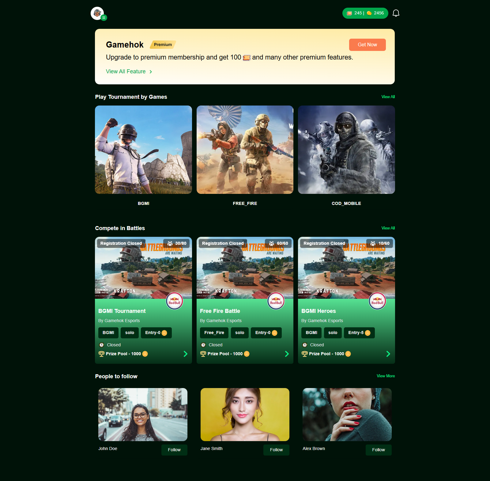
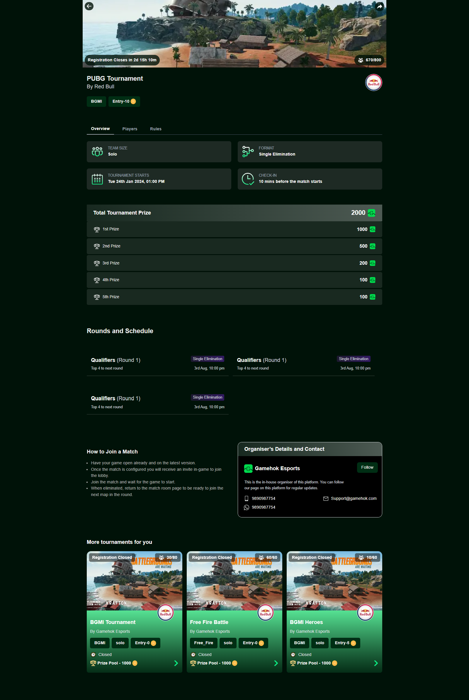
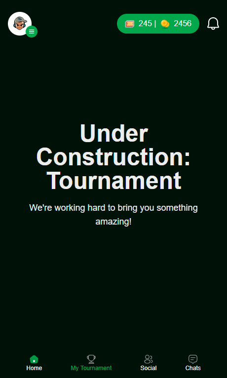
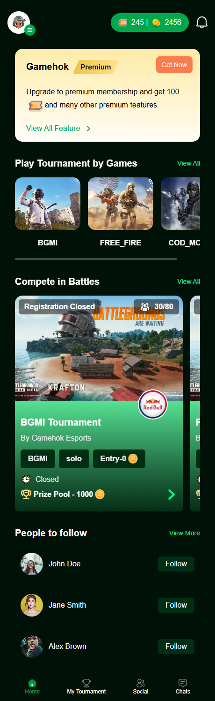
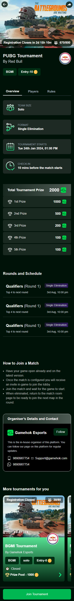

# Gamehook - Frontend Assignment

This project is a frontend implementation of the **Gamehook** platform as part of a submission for a frontend assignment. The design was created in Figma and implemented using modern frontend technologies. The application is fully **responsive** for both **desktop** and **mobile** devices.

## Project Overview

- **Pages**: 
  - **Home Page** – Landing page with general information and navigation.
  - **Tournament Page** – Displays tournament information and related details.
- **Responsive Design**: Optimized for both **desktop** and **mobile** using Tailwind CSS.
- **Animations & Interactions**: Built using **Framer Motion** for smooth animations and page transitions.
- **Data Fetching**: Uses **Fetch API** to retrieve dynamic content.
- **Design Source**: The project was developed according to the Figma design provided.

## Tech Stack

- **Framework**: [Next.js](https://nextjs.org/)
- **Styling**: [Tailwind CSS](https://tailwindcss.com/)
- **Animations**: [Framer Motion](https://www.framer.com/motion/)
- **Carousel/Slider**: [Swiper](https://swiperjs.com/)
- **Data Fetching**: Fetch API
- **Design Tool**: Figma
swiper

## Features

- Fully responsive layout for desktop and mobile devices.
- Interactive components with smooth animations.
- Home and Tournament pages implemented according to Figma design.
- Easy to extend for additional pages or features.

## Installation

1. Clone the repository:

```bash
git clone https://github.com/sohit-mishra/gamehok
```

2. Navigate to the project directory:
```
cd gamehook-frontend
```

3. Install dependencies:
```
npm install
```

4. Run the development server:
```
npm run dev
```

Open http://localhost:3000 in your browser to view the project.


# Mobile Testing

Connect your phone to the same Wi-Fi network as your computer and open the local IP with port 3000 in your mobile browser. For example:


http://192.168.1.41:3000


# Deployment

**Live Link:**  

[Visit Now](https://gamehok-red.vercel.app/)

# Figma Design

The design for this project was created in Figma and implemented pixel-perfect using Tailwind CSS.  
[Figma Design](https://www.figma.com/design/lVh3pgtrOOgFewvSOlSg78/Assignment?node-id=1032-95&t=vHSQeIfrDu32eNgl-0)

# Screenshots
### Desktop
  
  
  
  

### Mobile
  
  

# License

This project is for educational purposes as part of a frontend assignment.

